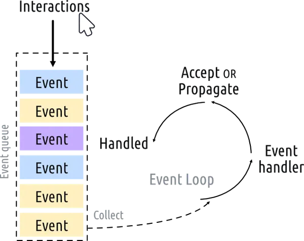

# PyQt5

## PyQt5 cơ bản

- PyQt5 là framework giúp tạo GUI trên desktop
- PyQt5 có 3 thành phần chính:
  - QtWidgets: Cung cấp các widget cơ bản như nút bấm, hộp văn,...
  - QtGui: Cung cấp các lớp để xử lý đồ họa như hình ảnh, màu sắc,...
  - QtCore: Cung cấp các lớp cơ bản như quản lý thời gian, xử lý sự kiện,...

## Implementation

### Tạo ứng app đầu tiên

```python
from PyQt5.QtWidgets import QApplication, QWidget

# Only needed for access to command line arguments
import sys

# You need one (and only one) QApplication instance per application.
# Pass in sys.argv to allow command line arguments for your app.
# If you know you won't use command line arguments QApplication([]) works too.
app = QApplication(sys.argv)

# Create a Qt widget, which will be our window.
window = QWidget()
window.show()  # IMPORTANT!!!!! Windows are hidden by default.

# Start the event loop.
app.exec()


# Your application won't reach here until you exit and the event
# loop has stopped.
```

### Concepts

#### Even loop

- Với mỗi Qt Applications là một `QApplication` class và cần một chỉ duy nhất một đối tượng `QApplication` để hoạt động 



- `app.exec()` sẽ bắt đầu event loop, lắng nghe và xử lý các sự kiện như click chuột, gõ bàn phím,...
- Ứng dụng sẽ tiếp tục chạy trong event loop cho đến khi `app.quit()` được gọi hoặc cửa sổ chính bị đóng
- Event loop giúp ứng dụng phản hồi nhanh với các sự kiện từ người dùng và hệ thống
- Event loop là một vòng lặp vô hạn, nó sẽ tiếp tục chạy cho đến khi ứng dụng kết thúc
- Mỗi khi có một sự kiện xảy ra, event loop sẽ kiểm tra và gọi hàm xử lý tương ứng
- Event loop cũng quản lý các tác vụ nền, như cập nhật giao diện người dùng, xử lý mạng,...

#### Signals and Slots
- Qt sử dụng cơ chế signals and slots để giao tiếp giữa các đối tượng
- Signals là các sự kiện được phát ra khi một hành động xảy ra.
- Slots là các hàm được gọi để xử lý các signals
- Có thể kết nối một signal với một slot bằng cách sử dụng phương thức `connect()`
- Khi signal được phát ra, slot tương ứng sẽ được gọi tự động
- Cơ chế signals and slots giúp tách biệt logic xử lý sự kiện khỏi giao diện người dùng, làm cho mã nguồn dễ bảo trì và mở rộng hơn

```python
from PyQt5.QtWidgets import QApplication, QMainWindow, QLabel, QLineEdit, QVBoxLayout, QWidget

import sys


class MainWindow(QMainWindow):
    def __init__(self):
        super().__init__()

        self.setWindowTitle("My App")

        self.label = QLabel()

        self.input = QLineEdit()
        self.input.textChanged.connect(self.label.setText)

        layout = QVBoxLayout()
        layout.addWidget(self.input)
        layout.addWidget(self.label)

        container = QWidget()
        container.setLayout(layout)

        # Set the central widget of the Window.
        self.setCentralWidget(container)


app = QApplication(sys.argv)

window = MainWindow()
window.show()

app.exec()
```

#### Widgets

- Widgets là các thành phần giao diện người dùng như nút bấm, hộp văn,...
- Mỗi widget là một đối tượng của một lớp con của `QWidget`
- Bạn có thể tạo các widget bằng cách khởi tạo các lớp con của `QWidget`
- Bạn có thể sắp xếp các widget trong cửa sổ bằng cách sử dụng các layout
- Layout giúp quản lý vị trí và kích thước của các widget trong cửa sổ

```python
import sys

from PyQt5.QtWidgets import (
    QApplication,
    QCheckBox,
    QComboBox,
    QDateEdit,
    QDateTimeEdit,
    QDial,
    QDoubleSpinBox,
    QFontComboBox,
    QLabel,
    QLCDNumber,
    QLineEdit,
    QMainWindow,
    QProgressBar,
    QPushButton,
    QRadioButton,
    QSlider,
    QSpinBox,
    QTimeEdit,
    QVBoxLayout,
    QWidget,
)

# Subclass QMainWindow to customize your application's main window
class MainWindow(QMainWindow):
    def __init__(self):
        super().__init__()

        self.setWindowTitle("Widgets App")

        layout = QVBoxLayout()
        widgets = [
            QCheckBox,
            QComboBox,
            QDateEdit,
            QDateTimeEdit,
            QDial,
            QDoubleSpinBox,
            QFontComboBox,
            QLCDNumber,
            QLabel,
            QLineEdit,
            QProgressBar,
            QPushButton,
            QRadioButton,
            QSlider,
            QSpinBox,
            QTimeEdit,
        ]

        for w in widgets:
            layout.addWidget(w())

        widget = QWidget()
        widget.setLayout(layout)

        # Set the central widget of the Window. Widget will expand
        # to take up all the space in the window by default.
        self.setCentralWidget(widget)

app = QApplication(sys.argv)
window = MainWindow()
window.show()
app.exec()
```

#### Layouts
- Layouts giúp quản lý vị trí và kích thước của các widget trong cửa sổ
- Qt cung cấp nhiều loại layout khác nhau như `QVBoxLayout`, `QHBoxLayout`, `QGridLayout`, `QFormLayout`
  - **QHBoxLayout:** Sắp xếp các widget theo hàng ngang
  - **QVBoxLayout:** Sắp xếp các widget theo hàng dọc
  - **QGridLayout:** Sắp xếp các widget theo lưới
  - **QFormLayout:** Sắp xếp các widget theo dạng biểu mẫu với nhãn và trường nhập liệu
- Bạn có thể sử dụng các layout để sắp xếp các widget trong cửa sổ một cách linh hoạt và tự động
- Layouts giúp giao diện người dùng thích ứng với các kích thước cửa sổ khác nhau

#### Menu and Toolbars

- Qt cung cấp các lớp để tạo menu và thanh công cụ trong ứng dụng
- Bạn có thể sử dụng `QMenuBar` để tạo thanh menu và `QToolBar` để tạo thanh công cụ
- Bạn có thể thêm các (actions) vào menu và thanh công cụ bằng cách sử dụng `QAction`
- Menu và thanh công cụ giúp người dùng truy cập nhanh các chức năng của ứng dụng
- Bạn có thể tùy chỉnh menu và thanh công cụ theo nhu cầu của ứng dụng
- Menu và thanh công cụ có thể được ẩn hoặc hiển thị theo ý muốn

#### QThread

- Qt cung cấp lớp `QThread` để tạo và quản lý các luồng trong ứng dụng
- Kế thừa lớp `QThread` và ghi đè phương thức `run()` để định nghĩa công việc của luồng
- Sử dụng phương thức `start()` để bắt đầu luồng và `wait()` để chờ luồng kết thúc

### Thực hành đa luồng với QThread

#### Bài toán

Tạo một project nhỏ, ứng dụng đa luồng QThread, cụ thể:
1. 1 luồng đọc frame từ video (Thread Capture)
2. 1 luồng xử lý frame nhận từ Thread Capture (Thread Process)
3. 1 luồng hiển thị frame (Thread Display)

#### Thực hiện

- Giao diện người dùng (GUI) chạy trên luồng chính (main thread)
- Đọc `VideoCapture` từ input (có thể từ webcam hoặc file video)

```python
class CaptureThread(QThread):
    frameCaptured = pyqtSignal(np.ndarray)

    def __init__(self, source: str | int = 0):
        super().__init__()
        self.source = source
        self.running = True

    def run(self):
        cap = cv2.VideoCapture(self.source)
        while self.running and cap.isOpened():
            ret, frame = cap.read()
            if not ret:
                break
            self.frameCaptured.emit(frame)
        cap.release()
        cv2.destroyAllWindows()

    def stop(self):
        self.running = False
```

- Xử lý frame

```python
class ProcessThread(QThread):
    frameProcessed = pyqtSignal(np.ndarray)

    def __init__(self, model_path: str = 'yolov8n.pt'):
        super().__init__()
        self.model = YOLO(model_path)
        self.running = True
        self.frame = None

    def setFrame(self, frame):
        self.frame = frame

    def run(self):
        while self.running:
            if self.frame is not None:
                results = self.model(self.frame)
                boxes = results[0].boxes.xyxy.cpu().numpy() if results else []
                for box in boxes:
                    x1, y1, x2, y2 = map(int, box[:4])
                    cv2.rectangle(self.frame, (x1, y1), (x2, y2), (0, 255, 0), 2)
                self.frameProcessed.emit(self.frame.copy())
                self.frame = None

    def stop(self):
        self.running = False
```

- Hiển thị frame

```python
class DisplayThread(QThread):
    updateDisplay = pyqtSignal(np.ndarray)

    def __init__(self):
        super().__init__()
        self.running = True
        self.frame_queue = queue.Queue(maxsize=10)

    def setFrame(self, frame):
        try:
            self.frame_queue.get_nowait()
        except queue.Empty:
            pass
        self.frame_queue.put(frame)

    def run(self):
        while self.running:
            if self.frame_queue.empty():
                frame = self.frame_queue.get()
                self.updateDisplay.emit(frame)
            self.msleep(6)

    def stop(self):
        self.running = False
```

- Tất cả những luồng đó sẽ được kết nối với nhau trong `MainWindow`

```python
class MainWindow(QWidget):
    def __init__(self, video_source: str | int = 0, model_path: str = 'yolov8n.pt'):
        super().__init__()
        self.setWindowTitle('Demo')
        self.label = QLabel()
        layout = QVBoxLayout()
        layout.addWidget(self.label)
        self.setLayout(layout)

        self.captureThread = CaptureThread(video_source)
        self.processThread = ProcessThread(model_path)
        self.displayThread = DisplayThread()

        self.captureThread.frameCaptured.connect(self.onFrameCaptured)
        self.processThread.frameProcessed.connect(self.onFrameProcessed)
        self.displayThread.updateDisplay.connect(self.onUpdateDisplay)

        self.captureThread.start()
        self.processThread.start()
        self.displayThread.start()

    @pyqtSlot(np.ndarray)
    def onFrameCaptured(self, frame):
        self.processThread.setFrame(frame)

    @pyqtSlot(np.ndarray)
    def onFrameProcessed(self, frame):
        self.displayThread.setFrame(frame)

    @pyqtSlot(np.ndarray)
    def onUpdateDisplay(self, frame):
        rgb = cv2.cvtColor(frame, cv2.COLOR_BGR2RGB)
        h, w, ch = rgb.shape
        bytes_per_line = ch * w
        from PyQt5.QtGui import QImage, QPixmap
        qt_img = QImage(rgb.data, w, h, bytes_per_line, QImage.Format_RGB888)
        self.label.setPixmap(QPixmap.fromImage(qt_img))

    def closeEvent(self, event):
        self.captureThread.stop()
        self.processThread.stop()
        self.displayThread.stop()
        
        self.captureThread.quit()
        self.processThread.quit()
        self.displayThread.quit()
        
        self.captureThread.wait()
        self.processThread.wait()
        self.displayThread.wait()
        event.accept()
```

## Augmentation for training YOLO model

- trong `train()` có các tham số để tăng cường dữ liệu (data augmentation) như `hsv_h`, `hsv_s`, `hsv_v`, `degrees`, `translate`, `scale`, `shear`, `perspective`, `flipud`, `fliplr`
  - `hsv_h`: Điều chỉnh độ sáng của màu sắc (hue) trong không gian màu HSV.
  - `hsv_s`: Điều chỉnh độ bão hòa (saturation) trong không gian màu HSV.
  - `hsv_v`: Điều chỉnh độ sáng (value) trong không gian màu HSV
  - `degrees`: Xoay hình ảnh ngẫu nhiên trong khoảng độ nhất định.
  - `translate`: Dịch chuyển hình ảnh ngẫu nhiên theo trục x và y
  - `scale`: Thay đổi kích thước hình ảnh ngẫu nhiên trong khoảng tỷ
  - `shear`: Cắt xéo hình ảnh ngẫu nhiên trong khoảng độ nhất định
  - `perspective`: Thay đổi phối cảnh hình ảnh ngẫu nhiên trong khoảng tỷ
  - `flipud`: Lật hình ảnh ngẫu nhiên theo chiều dọc với xác
  - `fliplr`: Lật hình ảnh ngẫu nhiên theo chiều ngang với xác suất nhất định

- Link dataset: https://drive.google.com/file/d/1roNilRaLMz4uLqZvINDAyxasG8ncwb5n/view?usp=share_link